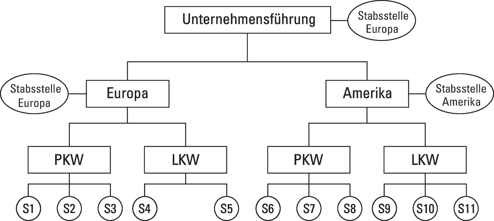
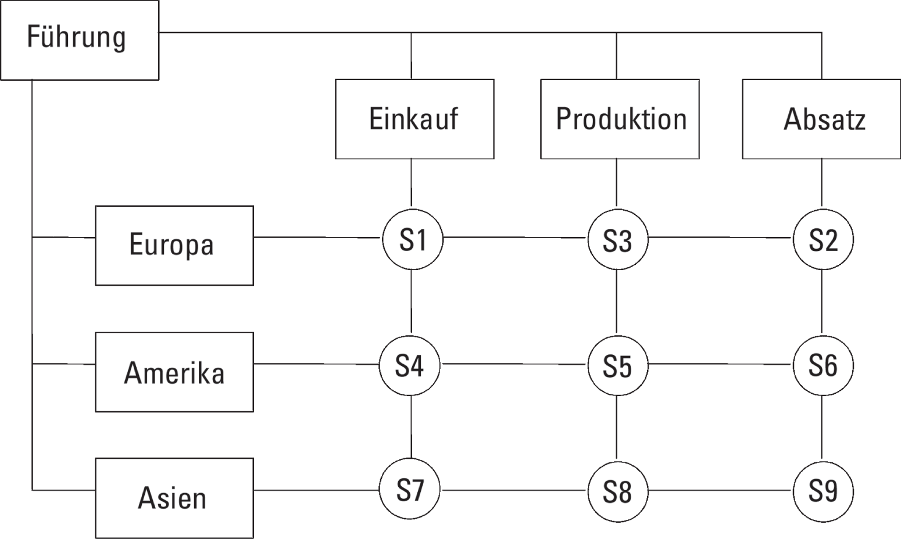

# ABWL

## Unternehmensführung

### Unternehmen

- rechtlich, wirtschaftliche und finanzielle organisierte Einheit
- komplexes System aus Ressourcen (HR, MR, FR)
  - HR = Mitarbeiter mit Fähigkeiten, Fertigkeiten, Wissen und Erfahrungen
  - MR = Maschinen, Gebäude, Material, Lizenzen
  - FR = Finanzielle Mittel $\rightarrow$ Eigen- und Fremdkapital
- weitgehend autonome Festlegung von Zielen $\rightarrow$ **Autonomieprinzip**
- Mitarbeiter bilden **soziales System** (Gruppen, Teams, Abteilungen, ...) $\rightarrow$ ausgerichtet auf Leistungserbringung (erwerbswirtschaftliches Prinzip), Austausch mit Unternehmensumwelt (Markt)

> Unterscheidung: **Betrieb** = Ort der Leistungserbringung; **Unternehmen** = ganzheitliche, rechtliche, finanzielle und wirtschaftliche Einheit des Betriebs

### Unternehmenspolitik

- Basis: Vision $\rightarrow$ Unternehmenspolitik $\rightarrow$ Unternehmensleitbild (aufgeschriebene Politik zur Kommunikation; **SOLL**)
  - $\rightarrow$ Unternehmenskultur (*Das was tatsächlich stattfindet*; **IST**)

> passt *SOLL* und *IST* zusammen, wird die höchste Leistungsfähigkeit erreicht

#### Inhalt eines Leitbildes

- **Know-how:** F&E, KVP
- **Ökonomie:** solides Unternehmen
- **Umwelt:** Ressourcen
- **Soziale Beziehungen:** Partner, Kunden, Mitarbeiter

> gesellschaftliche Verantwortung: Nachhaltigkeit (3 Säulen Modell: soz.Bez. $\leftrightarrow$ Ökonomie $\leftrightarrow$ Ökologie)

#### Äußere Einflussfaktoren auf die Unternehmenspolitik

- **Gesellschaftsordnung:** Kapitalismus
  - Erwerbswirtschaftliches Prinzip (langfristige Gewinnmaximierung), Privateigentum, ...
- **Politische Ordnung:** Föderalismus
  - Bundesstaatsprinzip $\rightarrow$ Teilstaaten mit beschränkter staatsrechtlicher Kompetenz
- **Rechtsordnung:** Öffentliches Recht, Verfassungs-, Straf-, Privatrecht
- **Wirtschaftsordnung:** soziale Marktwirtschaft
  - Verbindung von Marktwirtschaft und sozialem Ausgleich

### Marktbeurteilung

- **Polypol:** viele Anbieter, viele Nachfrager
- **Oligopol:** wenige Anbieter bzw. wenige ein Nachfrager
- **Monopol:** ein Anbieter bzw. ein Nachfrager

### Management

#### Managementkreislauf des funktionellen Managements

> Basis = Ziel/Aufgabe

- **Planing:** Analyse und Planung (HR, MR, FR)
- **Organizing:** Organisieren (Wahl der Mittel, Prioritäten, Koordination)
- **Staffing:** Personalwirtschaft (Personaleinsatz, Kombination von Organisation und Personal $\rightarrow$ Entscheiden)
- **Directing:** Mitarbeiterführung (Realisierung der Prozesse)
- **Controlling:** Kontrolle, Steuerung, Regelung

#### PDCA-Methode

> Methode zur Implementation von etwas Neuem im Unternehmen

- **Plan:** Aufgabe definieren, Analysieren, Planen, Entscheidungen
- **Do:** Ausprobieren, Testen $\rightarrow$ Daten
- **Check:** Analyse der Daten (Loop zu Do $\rightarrow$ so lange Probieren, bis `SOLL==IST`)
- **Act:** Realisierung, Daten sammeln ($\rightarrow$ Controlling $\rightarrow$ Verbesserung)

#### Controlling

- *kontinuierliche* Lenkung, Steuerung und Regelung, um ein Ziel zu erreichen
  - ständiger SOLL-IST-Vergleich $\rightarrow$ Lenkung, Rückkopplung auf Aufgaben & Ziele
- Kennzahl-Systeme: Du Pont, ZVEI, BSC, Kennzahlen-Cockpit, ...
  – Übersicht der Kennzahlen durch Anzeigen und Zeigerfunktionen
  - Ampel-System: farbliche Markierung des Erfüllungsstandes
- vgl. Kontrolle: nur *einmalige* Überprüfung, ob Ziel/Aufgabe erfüllt

### Aufbau- vs. Ablauforganisation

- **Aufbauorganisation:** **Struktur des Unternehmens** mit seinen Hierarchien
- **Ablauforganisation:** Organisation der **Durchführung von Prozessen**

### Instrumente der Ablauforganisation

- Netzplantechnik (Knotennetzplan)
- Ganttdiagramm
- Flussdiagramm
- Workflow

### Instrumente der Aufbauorganisation

- **Organigramm:** Hierarchie $\rightarrow$ Beziehungen, Aufgabenverteilung, Unterstellung
- **Informationsfluss:** Kommunikation $\rightarrow$ Top-Down, Bottom-Up
- **Stellenbeschreibung:** Anforderungen $\rightarrow$ Aufgabenbeschreibung, Anforderungsprofil

#### Organigramm

- Aufbaustruktur eines Unternehmens
- Hierarchische Unterstellung oder Aufgabenverteilung (Beziehungen)

#### Informationsfluss

**Formelle Wege**

- **Top-Down:** Entscheidung/Ziel/Aufgabe wird weitergegeben $\rightarrow$ Vorgaben, autoritär, MbR (Management by Results)
- **Bottom-Up:** Informationen kommen vom Arbeitsplatz $\rightarrow$ Realitätsprüfung
- wenn beides aufeinander trifft: kooperative Verhandlungen (*"Gegenstromprinzip"*, Management by Objectives)

**Informelle Wege:** *"Kleiner Dienstweg"*, *"Buschfunk"*

#### Stellenbeschreibung

- Grundlage des eigenständigen Handelns eines Mitarbeiters
- Aufgabenbeschreibung: Bezeichnung, Über-/Unterstellung, Aufgaben, Ziele, Befugnisse, ...
- Anforderungsprofil: fachliche, methodische und persönliche Kompetenzen

### Organisation

#### Verantwortung

> **Definition:** Übergabe durch den Vorgesetzten $\rightarrow$ Übernahme durch den Mitarbeiter
> $\rightarrow$ **Pflicht der Aufgabe/Ziel (Erfüllung)** = Verantwortung

#### Kompetenzen einer Stelle

- Weisung
- Entscheidung
- Verfügung
- Vertretung
- Information

#### Aufgabenanalyse und -synthese

- **Aufgabenanalyse:** Ermitteln von **elementaren (Teil-)Aufgaben** $\rightarrow$ fachlich und zeitlich **optimale Zusammenfassung/Bündelung zu Stelle**
- **Aufgabensynthese:** ökonomisch sinnvolle Aufgabenbündeln (von Stellen) zu Abteilungen bis hin zur Gestaltung der gesamten Aufbauorganisation $\rightarrow$ rationell gestaltete Arbeitsteilung im Unternehmen

#### Eisenhower-Matrix

> Dringlichkeit vs. Wichtigkeit

#### Liniensysteme

##### Einliniensystem

- **Einfachunterstellung:** jede Stelle und jede Abteilung besitzt genau einen Vorgesetzten
- **Vollkompetenz** und **Verrichtungszentralisation**

**Vorteile**

- klare, einfache, verständliche Gliederung
- eindeutige Zuordnung der Weisungsbefugnisse (Eindeutiger Dienstweg)
- deutliche Abgrenzung von Kompetenzen und Verantwortungsbereichen
- klare Regeln der Kommunikations- und Informationsbeziehungen

**Nachteile**

- langwierige Kommunikationswege
- hohe Belastung und Inanspruchnahme der höheren Instanzen
- geringe Flexibilität und Reaktionsgeschwindigkeit
- starre Entscheidungs- und Handlungsprozesse

##### Mehrliniensystem

- **Mehrfachunterstellung:** jede Stelle/Abteilung kann mehren Vorgesetzten unterstellt sein
- verkürzte Kommunikationswege $\rightarrow$ klare Weisungsunterstellung ablösen (vgl. Einliniensystem)

**Vorteile**

- kürzere Informations- und Kommunikationswege
- Entlastung der Unternehmensführung
- weniger Hierarchien, weniger Bürokratie
- bessere Entscheidung durch Einbindung mehrerer Instanzen

**Nachteile**

- Kompetenzüberschneidungen und -konflikte
- Unübersichtlichkeit (Verlust klarer Zuordnungen)
- unklare Verantwortungsbereiche

##### Stabliniensystem

- **Instanzen werden durch Stabsstellen unterstützt** (eher Ergänzung zu den Liniensystemen)
- Stabstellen nehmen den Instanzen Aufgaben ab (Kontrollaufgaben, Informationsbereitstellung, Beratung)
- Entscheidungsgewalt und Weisungsbefugnisse verbleiben bei den Instanzen

**Vorteile**

- **Entlastung** der Instanzen und der Unternehmensführung
- **höhere Qualität der Entscheidungen** (Sachverstand der Spezialisten)
- eindeutige Informations- und Kommunikationswege

**Nachteile**

- mögliche **Konflikte zwischen Entscheidern und Berater** (Instanz und Stabstelle)
- **Demotivierung der Stäbe** durch **mangelnde Kompetenz** Entscheidungen zu treffen
- **hohe Personalkosten**

#### Organisationsformen

##### Funktionalorganisation

- einfache Gliederung nach betrieblichen Verrichtungen
- Bündelung gleichartiger Tätigkeiten

> **Verrichtungszentralisation**, **Einfachunterstellung**, **Vollkompetenz**

##### Spartenorganisation

- Kombination zentraler und dezentraler Einheiten
- Objektdezentralisation (nach Produkten, nach Regionen, nach Kunden, ...)
- Vollkompetenz und Einfachunterstellung

##### Matrixorganisation

- Gliederung nach zwei Aspekten:
  - betriebliche Verrichtungen/Funktionen (Beschaffung, Produktion, Absatz, Verwaltung)
  - vorhandene Divisionen/Sparten (Produkte, Regionen, Kunden)

**Vorteile**

- gleichwertige Berücksichtigung von Funktionen und Sparten
- engere Kooperation zweier Instanzen
- direktere Kommunikation

**Nachteile**

- unklare Weisungsverhältnisse ($\rightarrow$ Konflikte)
- erhöhter Kommunikations- und Informationsaufwand
- längere Entscheidungsprozesse
- Zwang zur Kompromissbildung

#### Centerorganisation

> Modularisierungskonzept unter Betrachtung des Kapitalflusses $\rightarrow$ baut Maß der Selbständigkeit (*Dezentralität*) auf

- **Investment-Center:** Entscheidungskompetenzen für Investitionen und Desinvestitionen (**RoI**)
- **Profit-Center:** Aufgabe der **Gewinn**erzielung
- **Cost-Center:** Buchhaltung, Verwaltung, ... (notwendige Kosten $\rightarrow$ **Kostenminimierung**)
- **Revenue-Center:** Verantwortung für die zu erzielenden **Umsatz**erlöse

<!-- ToDo: Hier unbedingt nochmal über die einzelnen Funktionen drüberschauen (die Vierteilung macht in meinem Kopf noch keinen Sinn) -->

<!-- ToDo: Hier fehlen noch einige Themen -->

### Personalplanung

#### Inhalte der Personalplanung

- **qualitativ:** Beschaffung von MA, Definition benötigter Qualifikationen
- **quantitativ:** Personalbedarf des Unternehmens (Basis: Personalbestand, erwartete Zu-/Abgänge $\rightarrow$ Bedarfsrechnung)
#### Planungshorizont

- **operativ:** kurzfristige Prozess-Steuerung (z.B. Urlaubsplanung)
- **taktisch:** mittelfristig, Teilziele (>1-5 Jahre)
- **strategisch:** langfristig, grundlegende Ziele (>5 Jahre)

#### Gründe des quantitativen Personaleinsatzes

- **Ersatzbedarf:** Natürliche und künstliche Fluktuation
- **Neubedarf:** Expansion, neue Prozesse
- **Mehrbedarf:** Saisonale Schwankung oder Strukturveränderungen
- **Reservebedarf:** Ausfallbedarfe, Befristeter Bedarf
- **Nachholbedarf:** Unbesetzte Kapazitäten, neue Aufgaben

#### Inhalte des quantitativen Personaleinsatzes

<!--ToDo-->

#### Methoden zur Berechnung des quantitativen Personaleinsatzes

- **Analogie-Schlussmethode:** z.B. für 100 Aufträge 10 MA $\rightarrow$ für 150 Aufträge 15 MA
- **Schätzmethoden:** einfache Expertenschätzung oder systematisch unter Einbeziehung von Kennzahlen
- **Berechnung des Personalbedarfs:** Aktuelle Stellen (+/- Auf-/Abbau) - Aktuelle MA (+/- Zu-/Abgänge) = Bruttopersonalbedarf

#### Einflussgrößen auf die Personalkosten und deren  Bestandteile

- Einflussgrößen: Entstehung, Art, Entwicklung und Beeinflussung
- Bestandteile: Lohn-/Gehaltskosten, Lohnzusatzkosten, Personalbeschaffungskosten, Personalverwaltungskosten, Personalentwicklungskosten, sonstige Personalkosten

##### Einteilung von Personalkosten

- **direkte Kosten:** Lohn, Gehalt, Lohnzusatz
- **indirekte Kosten:** Personal-Beschaffung, -Entwicklung, -Verwaltung
- **weitere:** Weiterbildung, Consulting, ...

#### Inhalte der qualitativen Personalplanung

- fachliche, methodische, persönliche Kompetenzen
- notwendige, vorhandene, künftige Kompetenzen
- Kenntnis der **Potenziale der MA** (Definition vorhandener Potentiale der MA)
- **Anforderungsprofile** für eine Stelle (Definition notwendiger Anforderungen einer Stelle)
- Abgleich des Bedarfs (**SOLL-IST-Vergleich**)

#### Medien und Kanäle der Personalbeschaffung

- Social-Media
- Anzeigen in Werbeträgern
- Kontakte zu Bewerbern
- Präsenz auf Messen
- Zusammenarbeit mit Bildungsträgern
- Vorhandene MA

#### Wirkung der CI auf die Personalbeschaffung und dessen ausschlaggebenden Bestandteile

- Corporate Identity **wirkt nach innen & außen**
- Bestandteile: **Corporate Behaviour, Corporate Communication**
- **Orientierung für das Verhalten des Unternehmen** am Markt/Gesellschaft

#### Notwendige Tätigkeiten bei der Auswahl von Bewerbern

- Speichern
- Abfragen
- Kommunizieren
- Aufbereiten
- Zusagen
- Absagen
- Kosten
- Controlling

#### Einflussfaktoren zur Bestimmung einer Auswahlmethode

- Arbeitsmarkt
- Präferenz des Unternehmens
- Anforderungsprofil
- Unternehmensstandort
- Budget
- Zeit

#### interne vs. externe Personalbeschaffung

**Interne Personalbeschaffung:** Personalkapazitäten kurzfristig *innerhalb des Unternehmens* gewinnen

- $\oplus$ niedrige Beschaffungskosten
- $\oplus$ MA bezüglich Qualifikationen, Persönlichkeit und Fähigkeiten bekannt (Fehlbesetzung unwahrscheinlich)
- $\oplus$ MA-Zufriedenheit durch Aufstiegschancen
- $\oplus$ schnelle Einarbeitung
- $\ominus$ Auswahl begrenzt (vgl. Markt)
- $\ominus$ Betriebsblindheit
- $\ominus$ Neubesetzung der alten Stelle
- $\ominus$ evtl. hohe Weiterbildungskosten

**Externe Personalbeschaffung:** Personalkapazitäten auf dem *Arbeitsmarkt* gewinnen

- $\oplus$ großes Angebot von qualifizierten Bewerbern
- $\oplus$ neue Ideen, Einstellungen, Werte *(Frischer Wind)*
- $\oplus$ keine Ausbildungskosten und -zeiten
- $\ominus$ hohe Kosten der Personalbeschaffung
- $\ominus$ geringere Kenntnis des Betriebs (lange Einarbeitung)
- $\ominus$ Risiko von Fehlbesetzung

### Rechnungswesen

#### Notwendigkeit von Kennzahlen zur Führung von Prozessen

- Problemerkennung
- Situationsbewertung
- Darstellung von Zusammenhängen und Abhängigkeiten
- Grundlage für Entscheidungen
- Kontrolle von Entscheidungen
- Benchmark/Vergleich

> **Vergleichbarkeit, Verständlichkeit, Benutzerfreundlichkeit**

##### wesentliche Kennzahlsysteme

- **DuPont:** Fokus auf ROI
- **ZVEI:** Eigenkapitalrentabilität im Fokus
- **Rentabilitäts-Liquiditäts-Kennzahlensystem**
- **Kennzahlen-Cockpit:** Darstellungsform der Verknüpfung verschiedener Kennzahlen (Zielverfolgungssystem)

#### internes vs. externes Rechnungswesen

- **internes Rechnungswesen**
  - Kosten-Leistungs-Rechnung (KLR)
  - Selbstkosten der Produkte/DL mit Preiskalkulation
  - Controlling
- **externes Rechnungswesen:** externen Adressaten (Banken, Fiskus, Aktionäre)
  - Bilanz
  - Erfolgsrechnung (GuV)
  - Einschätzung und Ausblick des Unternehmens (Lagebericht)

#### Funktionen des externen Rechnungswesens

- **Informationsfunktion:** Informationsaustausch zw. Kapitalgeber und Management
- **Ausschüttungsbemessungsfunktion:** Gewinnermittlung und -verwendung
- **Entscheidungsanreizsystem:** Bilanzpolitik $\rightarrow$ Beeinflussung von Entscheidungen
- vergangenheitsorientierte **Dokumentation und Rechenschaftslegung**
- **gesetzliche Regelung:** beachten handels- und steuerrechtlicher Regelungen

#### Bedeutung des externen Rechnungswesens

- finanzielle Situation des Unternehmens nach außen kommunizieren
- Einhaltung rechtlicher Pflichten: Bilanz, Steuern, ...

#### Funktion der BSC

- Verbindungsglied zwischen Strategiefindung und -umsetzung
- traditionelle finanzielle Kennzahlen durch eine Kunden-, eine interne Prozess- und eine Lern- und Entwicklungsperspektive ergänzt

##### Vor- und Nachteile der BSC

| Vorteile                                                                     | Nachteile                                                                                                          |
| ---------------------------------------------------------------------------- | ------------------------------------------------------------------------------------------------------------------ |
| schneller, pointierter Blick auf wichtige Fakten                             | beliebige Wahl der Kennzahlen & Interpretationen                                                                   |
| Flexibilität, Anpassung an jedes Unternehmen durch Fülle an Kennzahlen mögl. | Vernachlässigung langfristiger Gewinne zu Gunsten kurzfristiger Gewinne, bei kompletter Ausrichtung auf Kennzahlen |
| einfache Programmierbarkeit und Aufnahme in die EDV bei Rechnersystemen      | Kennzahleninflation, bei zu vielen Kennzahlen stehen Nutzen und Erstellungsaufwand nicht in Relation               |

#### Vollkostenrechnung

- Erfassung aller Kosten und deren Zuordnung zum Produkt/DL
- feste Kosten, festes gewünschtes Einkommen, fester Preis

#### Teilkostenrechnung

- Aufteilung der Kosten nach Zurechenbarkeit $\rightarrow$ fix-Kosten / variable Kosten
- nachdem gewünschtes Einkommen & feste Kosten erreicht $\rightarrow$ Berücksichtigung variabler Kosten mit neuem (günstigerem) Preis

### Investition und Finanzierung

#### Einteilung der Investitionen und deren Inhalt

- **Objektbezug**
  - Sachinvestitionen (Gebäude, Maschinen, Roh- und Hilfsstoffe)
  - Finanzinvestitionen (Bankguthaben, festverzinsliche Wertpapiere, gewährtes Darlehn $\rightarrow$ Normalinvestition)
  - immaterielle Investitionen (Aus- und Fortbildung, Software, Patente)
- **Hierarchie**/Entscheidungsebenen
  - strategisch: im Top-Management entschieden, lange Laufzeiten (3-5 Jahre), Gebäude, Maschinenkomplexe,...
  - taktisch: im Middle-Management entschieden, mittelfristige Laufzeiten (1-3 Jahre), Ausrüstung
  - operativ: im Low-Management entschieden, kurzfristige Laufzeiten, routinemäßige Anschaffungen
- **Häufigkeit** des Anfallens
  - einzelne: einmalig, ohne Wdh.
  - als Folge: häufig anfallend, wiederholend
  - als Kette: wiederholend, Bedingtheit
- **Umfang** (Größenordnung)
  - Routine: geringer Zeitaufwand, Ersatz von Material, GWGs (Geringwertiges Wirtschaftsgut) & Schreibmaterialbestellung
  - Unternehmenspolitisch: hoher Zeitaufwand, bedeutend für die Leistungsfähigkeit, Ausrüstung
- der zu **erzielenden Wirkung**
  - Nettoinvestition: Gründung oder Erweiterung
  - Reinvestition: Ersatz, Rationalisierung, Umstellung, Diversifikation oder Sicherung

#### Vorgehensweise bei einer Investition

1. **Marktanalyse** (SWOT, Notwendigkeitsprüfung)
2. **Entscheidung zur Investition** (Umfang & Art der Investition, notwendige Kapitalstruktur)
3. **Angebote** (Lastenheft & Ausschreibung, Bereitstellung des Kapitals und Zuschlag)
4. **Realisierung** (Umsetzung, Abnahme der Investition)

#### Kriterien der Einteilung der Betrachtung von Finanzierungen

- **Fristenbezogen:** unbefristet (Kontokorrent), befristet (Kredit $\rightarrow$ kurz-, mittel- oder langfristig)
- **Kapitalarten:** Eigen-/Fremdkapital
- **Kapitalherkunft:** Außenfinanzierung (Beteiligungen, Fremdfinanzierung), Innenfinanzierung (Erträge, Freisetzungen)

#### Inhalt und Ursache einer Finanzierung

- Investition ist notwendig oder erwünscht $\rightarrow$ Abstimmung $\rightarrow$ Finanzierungsmöglichkeiten evaluieren
- entweder realisierbare Investionen (mit endgültigen Investitionsbedarf & Investitionsprogramm) oder nicht realisierbare Investition
- Größe des Kapitalbedarfs?
- Finanzierungsarten?
- Kostenoptimale Finanzierung?

### Protektionswirtschaft

> Form der Handelspolitik, geprägt durch staatliche Maßnahmen um die eigene Volkswirtschaft durch Handelshemmnisse zu schützen und Exportwirtschaft zu fördern.

- **Schutzfunktion:** einzelne Sektoren einer Volkswirtschaft vor Importkonkurrenz zu schützen
  - Zölle, Abgaben und/oder Preise auf bestimmte Waren/DL durch Land(DE)/Region(EU) aus wirtschaftlichem (tarifär) oder politischem Interesse (nicht tarifär)
- **Förderung:** eigenen Exportwirtschaft Vorteile auf dem internationalen Markt verschaffen
  - Erweiterung des Waren-/DL-Austausches zwischen bilateralen (zwei) oder multilaterale (mehreren) Handelspartnern
  - Maßnahmen zur Schaffung neuer Märkte oder politische Unterstützung einer Entwicklung

### Marketing

- Bedarf an Produkten/Dienstleistungen bekanntgeben
- ein Bild vom Unternehmen/Institution/Behörde/...
- ein Bild von der Leistung/Leistungsfähigkeit...
- ein Bild von den Produkten...

> oder eine Kombination daraus ... vermitteln

#### AIDA-Prinzip

- **A**ttention: Aufmerksamkeit wecken
- **I**nterest: Interesse erregen
- **D**esire: Wunsch Produkt/DL hervorrufen
- **A**ction: Kunde zum Kauf bewegen

#### Pull- vs. Push-Marketing

- **Push-Marketing:** Interesse wecken $\rightarrow$ Kunden zum Kauf animieren (Traditionelle Werbung)
- **Pull-Marketing:** Orientierung an den Bedürfnissen des Marktes $\rightarrow$ Interesse der Kunden nutzen (Nachfrage decken)

#### Produktlebenszyklus

- **Entwicklungsphase** (Prototyp, Funktionsmuster,...)
- **Einführungsphase** (Produkt Launch, Messeneuheit,...)
- **Wachstumsphase** (steigender Bedarf durch Nachfrage)
- **Reifephase** (Nachfrage aufgrund gesicherter Erwartung)
- **Sättigungsphase** (erste Angebote zur Steigerung der Attraktivität)
- **Degenerationsphase** (Abverkauf)

#### BCG-Matrix

> relativer Marktabteil vs. Marktwachstum

> der Produktlebenszyklus kann in die BCG-Matrix eingebettet werden

#### Möglichkeiten der Preisgestaltung

- **offensive Preispolitik:** **Hochpreispoltik** (aufwendiges Verkaufsambiente und/oder hochwertige Ware), **Niedrigpreispolitik** (Discount)
- **defensive Preispolitik:** kein Engagement im Preiskampf (Anpassen der Preise an Wettbewerb und/oder Überzeugung durch Leistung), Herstellerempfehlung (Markenprodukt)

#### Instrumente des Marketings

- **Produkt-/Dienstleistungspolitik**
  - Produkt-/Dienstleistungsportfolio
  - Breite & Tiefe des Sortiments
  - Aktualität
- **Distributionspolitik**
  - Vertrieb
  - Bereitstellung und Logistik
  - Pflege der Kundenbeziehungen
- **Kommunikationspolitik**
  - Werbung
  - Einsatz der Werbemittel/-Träger und Zielgruppenansprache
- **Preispolitik**
  - Preis der Produkte/Dienstleistungen
  - Angebot und Nachfrage

## Projektmanagement

> Die Durchführung eines Projektes besteht aus dem Projekt selbst und dem Projektmanagement

- **Projekt:** risikobehafteter, hoch komplexer Gegenstand einer Handlung (Ziel/Aufgabe) mit begrenzten Ressourcen (HR, MR, FR) in einem bestimmten Zeitrahmen
- **Projektmanagement:** Organisation von Ablauf, Abrechnung und Dokumentation der Umsetzung eines Projektes
- **Kontinuierlicher Verbesserungsprozess:** durch Markt (Wettbewerb, Kunde) und technisch-technologischen Fortschritt getrieben

### Projekt vs Projektmanagement

| Projekt                                           | Projektmanagement                        |
| ------------------------------------------------- | ---------------------------------------- |
| Gegenstand einer Handlung (Ziel/Aufgabenstellung) | Umsetzung des Projektes (Projektauftrag) |
| begrenzte Ressourcen                              | Organisation                             |
| hoch komplex                                      | Ablauf                                   |
| Zeitrahmen                                        | Abrechnung                               |
| Risiko                                            | Dokumentation                            |

### Grundsätze der Projektplanung

- **Einheitliche Planungsmethoden:** Vergleichbarkeit, Benchmark, Synergien Nutzen, Transparenz
- **Einheitliche Planungsstandards:** Verständnis bei allen Beteiligten, Abrechenbarkeit und Kennzahlsysteme, Transparenz
- **Nutzung geeigneter Projektsoftware:** Sparsamkeitsprinzip, Nutzung von Bekannten, Optimierung des zeitlichen Aufwandes
- **Nutzung von Projekterfahrung:** Verbesserung des Verständnisses, Risikominimierung, Motivations- und Wissensmanagement

<!-- ToDo: Das Thema fehlt sonst noch komplett -->

## Qualitätsmanagement

### Qualität und Qualitätsmanagement

- **Qualität:** Anspruch an eine Sache/Leistung/Person (benötigt Maßstab)
- **Qualitätsmanagement:** Maßnahmen zur Durchsetzung der Erwartungen
  - Überprüfung der Maßnahmen nach Sinn, Effizienz und Effektivität

### Ziele und Wirkungen von Qualitätsmanagement

**Ziele**

- kontinuierliche Organisation zur Überprüfung der Qualität (bspw. TÜV)
- Schulung und Qualifikation der Mitarbeiter

**Wirkung**

- frühzeitiges Erkennen von Qualitätsverlusten $\rightarrow$ Verbesserung ableiten
  - Möglichkeit der Qualitätssteigerung
  - Ausschuss vermeiden
  - Kundenbindung durch bessere Qualität
- Einhaltung von Qualitätsstandards

### Qualitätspolitik

> Qualitätspolitik ist Unternehmenspolitik!

- **Vision des Unternehmens** (Philosophie): Produkt/DL
- $\uparrow$ **Unternehmenspolitik:** Produkt/DL; Personal, Kunden, Partner; Nachhaltigkeit; **Qualität**
- $\uparrow$ **Unternehmensleitbild:** Publikation der Unternehmenspolitik
- $\uparrow$ **Unternehmenskultur:** Umsetzung; Realisierung; KVP

> Alles baut aufeinander auf.

### Notwendige Instrumentarien zur Qualitätsbestimmung

- **Leitbild:** Unternehmensleitbild zur Realisierung von Qualität
- **Struktur:** Unternehmensstruktur (Aufbauorganisation)
- **Prozesse:** Prozessabläufe im Unternehmen (z.B. innerbetriebliche Logistik)
- **Stellenbeschreibung** für alle Mitarbeiter
- **Beurteilung** von Leistung und Verhalten der Mitarbeiter
- **Realisierung** der Vorgaben (Unternehmenskultur)

### Klassische Qualitätssicherung vs TQM

> TQM umfasst aufzeichnende, sichtende, organisierende, kontrollierende und korrigierende Tätigkeiten

| Klassische Qualitätssicherung                                     | Total-Quality-Management                                                          |
| ----------------------------------------------------------------- | --------------------------------------------------------------------------------- |
| **Menschen** machen Fehler                                        | **Prozesse** provozieren Fehler                                                   |
| **Einzelne Mitarbeiter** sind für Fehler verantwortlich           | **Alle Mitarbeiter** sind für Fehler verantwortlich                               |
| Null Fehler sind **nicht realisierbar**                           | Null Fehler ist das **Ziel*                                                       |
| Einkauf von **vielen Lieferanten**                                | Partnerschaft mit **wenigen Lieferanten** ($\rightarrow$ Supply-Chain-Management) |
| **Kunden müssen nehmen**, was das Unternehmen an Qualität liefert | Alles ist auf vollkommene **Kundenzufriedenheit** ausgerichtet                    |
